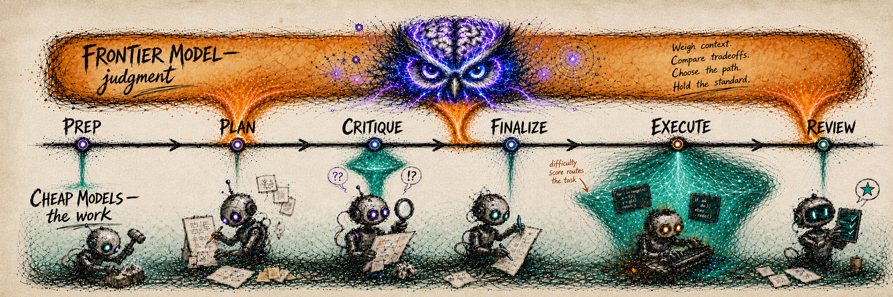
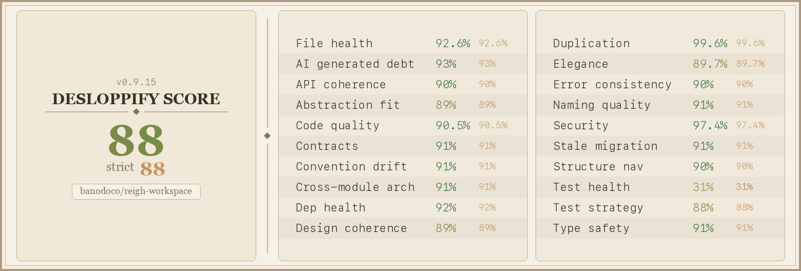

# Arnold — Build Intelligent Pipelines

Arnold is a tool for building intelligence systems out of many coordinated models. Today you can experience one slice of that through its first tool, **Megaplan** — a planning and execution harness for software. More on building and sharing your own pipelines soon.

---

## Megaplan - a pipeline for cost-efficient advanced planning and execution


It breaks building software into structured, independently-checked phases — making intelligent-but-unreliable LLMs systematically robust, and letting each phase run on the cheapest model that can do it well.

## Megaplan's philosophy

Two ideas, and they reinforce each other.

**1. Structure makes LLMs robust.** Modern LLMs are highly intelligent but systematically unreliable. Left to their own devices they skip steps, miss concerns, rubber-stamp their own work, and research sloppily. Megaplan breaks the whole process into explicit stages — `prep`, `plan`, `critique`, `gate`, `revise`, `finalize`, `execute`, `review` — each scoped and equipped so the model does one thing well, and each checked by a *separate* pass instead of the model grading itself. That structure is what turns raw intelligence into something that can deliver a real-world sprint end-to-end, reliably.

**2. Use the cheapest capable model per component.** Premium closed models (Claude, GPT/Codex) are overkill for the vast majority of software tasks; open models that are **~40× cheaper** — primarily **DeepSeek v4-pro** — do most of the work just as reliably. The goal is to use the cheapest model that can *reliably* perform a given task, and to spend premium budget only where it actually changes the outcome.

The two connect: the same decomposition that makes the process robust is what lets you price it. Once work is broken into stages and tasks, each routes to the cheapest model that can handle it — premium models reserved for two jobs: **adjudicating** which model handles each piece, and the genuinely **hard** parts.

Read more about the philosophy and a worked example in [How You Can Move >90% of Your Coding to DeepSeek](docs/megaplan-intro.md).

## How it works



```
prep → plan → critique → gate → [revise → critique → gate]* → finalize → execute → review
```

Each phase can run on a different model. For example, here's how the default **`partnered`** profile splits the work:

| Cheap (DeepSeek) | Premium (Claude or Codex) |
|---|---|
| `prep` — repository research | `plan` / `revise` — design the plan |
| `gate` — mechanical pass/fail | `finalize` — **adjudicates** task difficulty 1–5 |
| `critique` — independent review *(directed by the premium critique-evaluator)* | `execute` — hard tasks (tiers 7–10 → premium models) |
| `execute` — easy tasks (tiers 1–6) | `review` |

`finalize` is the **adjudicator**: it scores each task's complexity 1–5, and that score routes execution — trivial tasks to DeepSeek-flash, ordinary tasks to DeepSeek-pro, and only cross-cutting (4) or fundamental (5) tasks up to Sonnet/Opus. Independent critique and gating prevent rubber-stamping, and the visible `prep` phase makes repository investigation observable instead of hiding it inside `plan`. Open models critique reliably **when a premium model directs them**: a premium critique-evaluator picks the lenses and rejects weak findings while a cheap DeepSeek critic runs them.

That split isn't fixed. The harder the work, the more it justifies premium models on more phases; the simpler it is, the more aggressively it can run on open models. The named profiles are five rungs of exactly this trade-off — `solo` (all-open, for mechanical work) → `directed` → `partnered` (the default) → `premium` → `apex` (all-premium) — and you can define custom profiles to combine models any way you like.

**A note on the word "premium."** In megaplan's internals there is an *agent spec* `premium` (e.g., `premium:low`) — a symbolic placeholder that means "the operator's selected premium vendor." It appears in `DEFAULT_AGENT_ROUTING` and in unlocked profile TOMLs to keep vendor-neutral premium phases from silently locking to a single provider. Do not confuse it with the **profile** named `premium` (the fourth built-in tier). The agent spec never reaches dispatch; it is always resolved to `claude` or `codex` based on the `--vendor` flag (or `[agent] vendor` in config, or the project default) before any worker is launched. User `agents.<phase>` config entries must be concrete (`claude`, `codex`, `hermes`), never `premium`.

**[docs/megaplan-prep.md](docs/megaplan-prep.md)** is a skill document for you and your agents — hand it the task and it picks the profile, robustness level, and thinking tier to match.

## Quick start

Hand this to your coding agent:

```
Please install and set up megaplan for this project:

Clone it as a local editable checkout so I can inspect and edit the source:

cd ~/Documents
git clone https://github.com/peteromallet/arnold.git
cd arnold
python -m pip install -e .
python -m arnold_pipelines.megaplan setup

The default `partnered` profile pairs a premium model (Claude or Codex) with cheap DeepSeek. Ask me for whichever I have — an Anthropic/Claude or OpenAI/Codex login — plus a DeepSeek API key (or Fireworks key), and wire them up.

Before initializing a plan, read docs/megaplan-prep.md and use it to choose the profile, robustness level, and thinking tier for my task. Once set up, ask me what I need megaplan for.
```

Or do it yourself:

```
cd ~/Documents
git clone https://github.com/peteromallet/arnold.git
cd arnold
python -m pip install -e .
python -m arnold_pipelines.megaplan setup
```

The setup command detects your installed agents and walks you through credentials. The old `[agent]` extra remains as a no-op compatibility alias on current releases, but it is no longer required. You need two things:

- **A premium model** — **Claude** (the default; your Claude Code login or `ANTHROPIC_API_KEY`) **or Codex** (your Codex login or `OPENAI_API_KEY`, selected with `--vendor codex`). The public `claude` agent route always uses the Shannon-backed interactive tmux worker — it preserves OAuth subscription billing and never falls back to a headless `claude -p` subprocess.
- **DeepSeek access** for the cheap phases — a **`DEEPSEEK_API_KEY`** (the default route) or a **Fireworks** key (`FIREWORKS_API_KEY`, via `--deepseek-provider fireworks`).

Direct-provider keys live in `~/.hermes/.env`. Then point megaplan at an idea:

```bash
python -m arnold_pipelines.megaplan init --project-dir . "Fix the authentication bug in login.py"
```

In subagent mode (the default for Claude Code and Codex) the agent drives the phases and returns at breakpoints. To run them by hand, reuse the same verified launcher: `python -m arnold_pipelines.megaplan plan|critique|gate|finalize|execute --plan <name>`.

## Development

Install the editable runtime (including the pytest runner used by resident and
subagent verification), then run the focused CI-equivalent suite locally:

```bash
python -m pip install -e .
python -m pytest tests/characterization/test_import_surface.py tests/test_pipeline_run_cli.py tests/test_chain_done_gate.py tests/arnold/workflow/test_m5_inventory_scanners.py tests/cli/test_m5_workflow_cli.py tests/arnold/conformance -q
```

## Some other features

- **Epics** — chain many sprints into one long-running effort. Megaplan runs them in sequence with carried context, so it can deliver the equivalent of months of work reliably instead of one sprint at a time.
- **Different models per phase** — pick a named profile (`python -m arnold_pipelines.megaplan init --profile <name>`) or override one phase (`--phase-model execute=claude`). Inspect with `python -m arnold_pipelines.megaplan config profiles list`; define your own in `.megaplan/profiles.toml`. Built-ins span all-Claude, all-Codex, all-DeepSeek, and all-open (Kimi/GLM via OpenRouter).
- **Cloud runs** — `python -m arnold_pipelines.megaplan cloud` runs a plan (or a whole chain) on a remote Railway box with a persistent workspace volume, so it outlives your terminal. Ask your agent to `python -m arnold_pipelines.megaplan cloud bootstrap <idea>`. See [docs/cloud.md](docs/cloud.md).
- **Bake-offs** — `python -m arnold_pipelines.megaplan bakeoff` runs the same idea through multiple profiles concurrently (one git worktree each), compares the results, and merges only the human-picked winner — the way to find the cheapest model mix that still passes review.
- **Metaplan mode** — produce a design doc / RFC / spec instead of a code diff: `python -m arnold_pipelines.megaplan init --mode metaplan --output docs/foo.md "..."`.
- **Robustness levels** — `--robustness light|standard|robust|superrobust` dials critique depth and parallelism, from a single critique pass up to parallel critique + parallel review.
- **Database mode** — keep state in Supabase Postgres instead of `.megaplan/` for shared state across machines and cloud runs (`pip install 'arnold[db]'`, then set `MEGAPLAN_ACTOR_ID`).
- **Observability** — `python -m arnold_pipelines.megaplan status --plan <name>` shows the active step, cost, execute progress, and next-step guidance.
- **Configuration** — `python -m arnold_pipelines.megaplan config show | set <key> <value> | reset` tunes timeouts, critique concurrency, and per-phase agents. See [docs/configuration.md](docs/configuration.md) for the full config and environment map.
- **Adaptive critique defense** — `python -m arnold_pipelines.megaplan doctor --adaptive-critique` probes the adaptive critique wiring; `[execution] strict_adaptive_critique = true` refuses silent fallback to static lenses on production runs. See [docs/critique.md](docs/critique.md).

## Code health



## License

[Open Source Native License (OSNL) 0.2](LICENSE). Free for internal use by anyone, including commercial companies. Redistribution inside a product or service is free for entities that open-source their own primary assets; otherwise requires a separate commercial license. See [LICENSE](LICENSE) for full terms.
