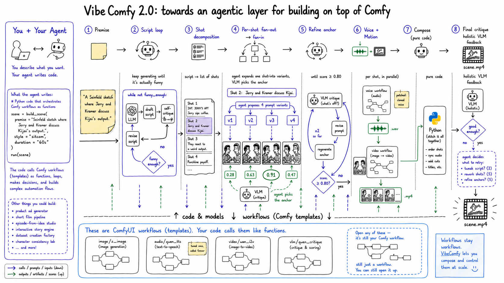

# VibeComfy

**VibeComfy is an agentic interface for you and your agent to build on top of ComfyUI.** You load a workflow (a ready template, an indexed JSON workflow, or one you author from scratch) into a single editable IR — `VibeWorkflow` — tweak it, and then build on top of it, combining it with other workflows and plain Python into an agentic loop. The goal is to make it as easy as possible to build complex creative loops on top of Comfy that run entirely locally.



## Give this to your agent to get started

Paste this into your coding agent (Claude Code, Cursor, Codex, …):

```
Please set up VibeComfy for me:

1. Clone https://github.com/peteromallet/VibeComfy into the current directory.
2. Install it with `uv sync` (or `pip install -e .`). This pulls in ComfyUI
   as a normal Python dependency via hiddenswitch/pip-and-uv-installable-ComfyUI.
3. Run `python -m vibecomfy.cli sources sync` to build the indexes.
4. Read .claude/skills/vibecomfy/SKILL.md to learn the authoring surface.
5. Ask me what I'd like to create (image, video, or audio), then run a small
   test generation end-to-end to confirm everything works. The
   `image/z_image` ready template is a good cheap default for a first run.
```

That's the whole install. The bundled skill at [`.claude/skills/vibecomfy/SKILL.md`](.claude/skills/vibecomfy/SKILL.md) teaches the agent the full surface — discovery, loading, editing, patches, blocks, recipes, and the embedded / server / RunPod runtimes.

## Thanks

VibeComfy is a thin Python authoring layer. The real work belongs to:

- **[`pip-and-uv-installable-ComfyUI`](https://github.com/hiddenswitch/pip-and-uv-installable-ComfyUI)** by [Dr. Pangloss / hiddenswitch](https://github.com/hiddenswitch) — the fork that makes ComfyUI installable as a normal Python package, which is what lets VibeComfy embed Comfy at all.
- **[ComfyUI](https://github.com/comfyanonymous/ComfyUI)** by **comfyanonymous** and the wider Comfy community, plus the custom-node pack authors VibeComfy indexes (KJNodes, VideoHelperSuite, WanVideoWrapper, LTXVideo, rgthree, was-node-suite, and many more).
- **The workflow builders** whose graphs the ready templates are based on — [Kijai](https://github.com/kijai), the [Comfy team's official examples](https://github.com/comfyanonymous/ComfyUI_examples), and many others across the community whose published workflows we adapted into the `ready_templates/` set.
- **The open-source model authors** whose weights every workflow actually runs — Black Forest Labs (Flux), Tencent (Hunyuan), Alibaba (Wan, Qwen), Lightricks (LTX-Video), Stability AI (SD/SDXL), and the long tail of fine-tuners and LoRA authors releasing openly on Hugging Face and Civitai.
