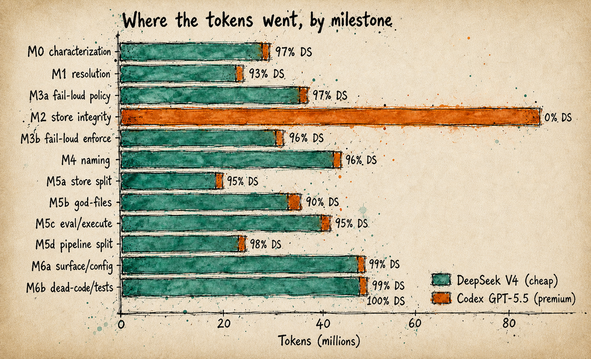
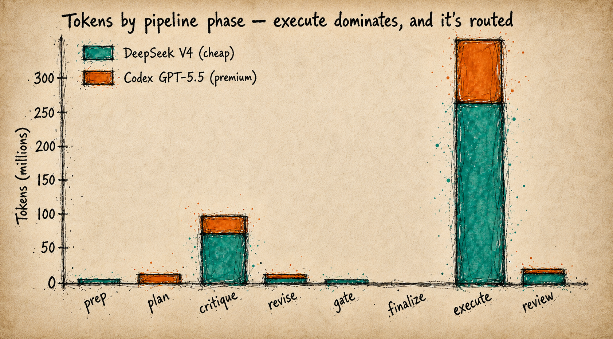
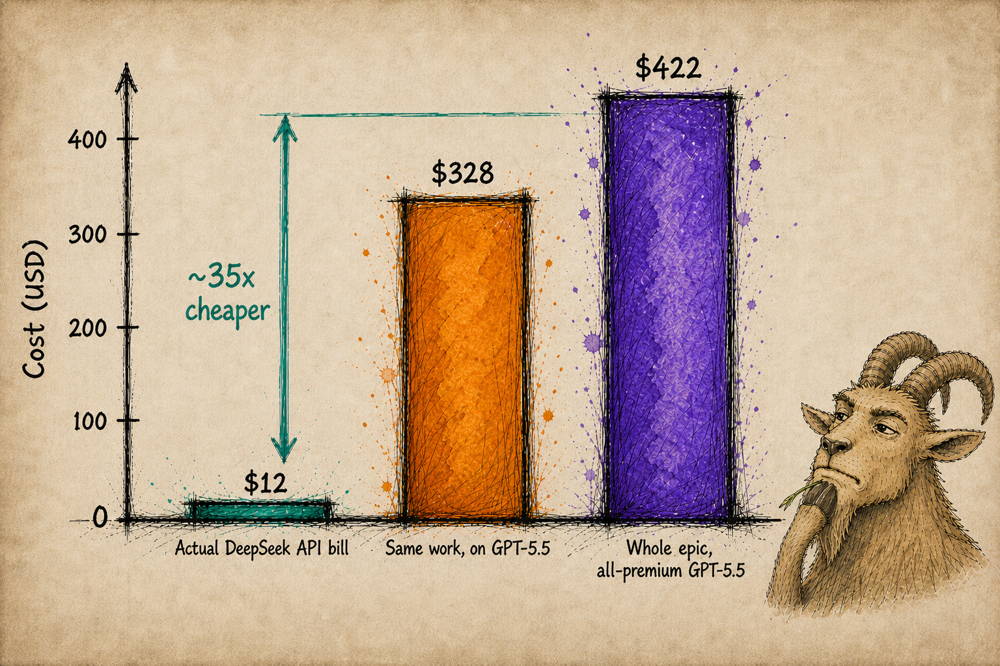

# How You Can Move >90% of Your Coding to DeepSeek - While Improving Robustness and Execution Quality, at ~2.5% of the Cost (Megaplan via Arnold)

Right now, most of our coding runs on temporarily subsidised AI - sustained by the goodwill of a handful of temperamental monopolies. You should want to move as much of your work as possible onto stable, reliable, open-source models. But how?

Over the past few months I've been building a harness that does exactly that: it moves >90% of my token usage onto DeepSeek while *improving* robustness and execution quality. Below are the lessons, the tool itself, and a real project run end-to-end with it.

For this project, **DeepSeek wrote 100% of the code on 11 of the 12 milestones** - **242 files changed** - for a real DeepSeek API bill of about **$12**. A frontier model handled only the decisions that actually needed intelligence; running the whole thing on a premium model instead would have cost **~$422**.

First, the insights:

## 1. Premium models are overkill for most tasks - and often unreliable

Premium models earn their keep on complex planning and intricate execution. But most of the tasks inside a real coding project just… aren't that. Premium models are overkill for most tasks. Even in complex projects there are *so* many simple tasks - researching one element, making a documentation change, refactoring something, moving files around.

Even the most intelligent models are inconsistent: sometimes, they'll run a thorough research process; other times they won't. Sometimes they'll run the tests; sometimes they won't. 

## 2. Routing every task by hand is a huge mental task

Say you buy that most work can go to cheaper models, you still have to decide *which* model does *what*, task by task. Is this one simple enough for a cheap model, or does it need a frontier one? Get that wrong in one direction and you're back to paying frontier prices to hammer in nails; get it wrong in the other and a weaker model quietly botches something that needed the horsepower. Routing every task by hand is a huge mental task.

## 3. Frontier models are great at judging difficulty

With appropriate context, frontier models are now extremely good at assessing how difficult a given task is. Give one a bit of guidance and it can look at each stage of a plan and sort the hard tasks - the ones that need real power - from the easy ones.

## Putting it together: Megaplan

[Megaplan](https://github.com/peteromallet/arnold) is a free, open-source harness pipeline that combines these three insights, and the first pipeline built on **Arnold**, an open framework for assembling your own. Megaplan runs your work through a fixed sequence of phases - prep, plan, critique, gate, revise, finalize, execute, review - and at *every* step it separates the **judgment** from the **labour**: the frontier model makes the few expensive decisions, and cheap models do the high-volume work those decisions create.

That split runs through the whole pipeline:

- **Prep** - the frontier model triages what's genuinely unknown and worth researching; cheap models fan out and do the digging.
- **Plan** - the frontier model authors the plan. This is real architecture, so it earns the spend.
- **Critique** - the frontier model decides *which* review lenses are worth running against the plan; cheap models run them in parallel.
- **Finalize** - the frontier model scores each task's difficulty 1–5. That single judgment is what drives all the routing beneath it.
- **Execute** - each task is dispatched to the cheapest model that can do it: the bulk to DeepSeek, only the genuinely hard tasks escalated to premium.

That's two funnels in one. **Across the pipeline**, the expensive model is reserved for the handful of decisions that need real intelligence - what to research, how to plan, what to check, how hard each task is. **Within execution**, every task then drops to the cheapest model that can reliably do it. The whole idea: stop paying frontier prices to hammer in nails, and let a frontier model decide only the few places where high intelligence is actually worth it:


And because every step is *enforced*, you get robustness a raw model won't reliably give you: prep always gathers context, the plan always gets critiqued, every task is tracked to done, and the tests have to pass before a step is allowed through. You're not hoping the model remembers to be thorough - the harness makes it. That enforced rigour is exactly what makes it safe to hand the actual work to a cheaper model.

---

# Case study: refactoring megaplan's own core - most of the code written by DeepSeek

Over the last few days, I pointed megaplan at its own codebase and ran a **12-milestone core-hardening epic** - refactoring megaplan's own core: unify a duplicated next-step resolution contract, make state-file writes merge-aware, turn ~1,000 silent `except: pass` sites into loud failures, unify a homonym-plagued vocabulary, and split a handful of 3,000–5,000-line god-files into focused modules. The merged result was large: **242 files changed, +21,709 / −18,440 lines.**

This is the *least* forgiving kind of work for the "offload to cheap models" thesis. It's structural surgery on a live planning-and-execution engine, where a small semantic slip can corrupt run state, misroute a recovery decision, or make a failure vanish silently. It's exactly the situation where the reflex is "put the frontier model on everything." And yet every milestone passed its characterization gate and review - no regression the safety-net or a reviewer could detect, across the core's **~93,000 lines of code** - while the **cheap model wrote the overwhelming majority of it**: 100% of the code on eleven of the twelve milestones. (DeepSeek's share of *tokens* is lower - ~78% - because the one milestone it didn't touch, M2, is by far the most token-heavy of the twelve. Measured on code actually written, **DeepSeek's share is well over 90%**.)

## The twelve milestones

The epic consisted of twelve milestones, run back-to-back, each landing on `main` only after passing its own characterization gate and review. (Commit links go to GitHub; the early milestones were committed in two shared checkpoints, the later ones one-per-milestone.)

| Milestone | What it did | Tokens | On DeepSeek (tokens · code) | What premium did | Commit |
|---|---|---|---|---|---|
| M0 · characterization | Built the regression safety-net (import smoke, CLI snapshot, golden e2e, store-contract parity) | 18M | 97% of tokens · **100% of code** | planned the net + adjudicated sufficiency | [`a6417ca`](https://github.com/peteromallet/arnold/commit/a6417cae) |
| M1 · resolution | Unified two contradictory next-step resolution contracts into one module with a disk/memory discriminator | 13M | 93% of tokens · **100% of code** | owned the contract design + per-caller migration table | [`a6417ca`](https://github.com/peteromallet/arnold/commit/a6417cae) |
| M3a · fail-loud policy | Censused 1,049 silent `except` handlers, produced the decision table, replaced the agreed bare passes | 38M | 97% of tokens · **100% of code** | designed the decision table + scope boundaries | [`a6417ca`](https://github.com/peteromallet/arnold/commit/a6417cae) |
| M2 · store integrity | Collapsed 3 divergent `state.json` writers into one merge-aware `write_plan_state()`; added validation + backend parity | 88M | **0% - pinned all-premium** | **did all phases - store work tolerates zero ambiguity** | [`928e830`](https://github.com/peteromallet/arnold/commit/928e830b) |
| M3b · fail-loud enforce | Turned the census's raise/halt sites into hard halts with forensic backups of corrupt artifacts | 31M | 96% of tokens · **100% of code** | adjudicated which sites halt vs warn | [`928e830`](https://github.com/peteromallet/arnold/commit/928e830b) |
| M4 · naming | Vocabulary sweep across 283 files: fixed the gate/step/verdict homonyms, dropped a duplicate key | 43M | 96% of tokens · **100% of code** | decided which term keeps each word | [`928e830`](https://github.com/peteromallet/arnold/commit/928e830b) |
| M5a · store split | Split `store/db.py` (3,838 loc) + `store/file.py` (2,636 loc) into 28 per-entity modules | 19M | 95% of tokens · **100% of code** | chose the cut lines + reviewed | [`928e830`](https://github.com/peteromallet/arnold/commit/928e830b) |
| M5b · god-files | Chopped `cli.py` (5,217 loc) into 9 modules, extracted chain git-ops + worker mocks, deleted 8 prompt shims | 34M | 90% of tokens · **100% of code** | planned the splits + scored complexity | [`653ee51`](https://github.com/peteromallet/arnold/commit/653ee51c) |
| M5c · eval/execute | Split the coupled `evaluation.py` + `execute/core.py` god-files into facades over concern modules | 42M | 95% of tokens · **100% of code** | validated the decomposition design | [`05a433d`](https://github.com/peteromallet/arnold/commit/05a433d4) |
| M5d · pipeline split | Split `_pipeline/patterns.py` (874 loc) + `phase_result.py` (720 loc) into concern modules | 24M | 98% of tokens · **100% of code** | decided what to split and how | [`96b5e66`](https://github.com/peteromallet/arnold/commit/96b5e66b) |
| M6a · surface/config | Replaced 15 copy-pasted profile defaults with one `SYSTEM_DEFAULT_PROFILE` constant; fixed CLI flag drift | 49M | 99% of tokens · **100% of code** | design + complexity adjudication | [`ee730c1`](https://github.com/peteromallet/arnold/commit/ee730c15) |
| M6b · dead-code/tests | Removed dead/demo code; split the 5,323-line `test_workers.py` into 9 modules behind a collect-count parity gate | 46M | 100% of tokens · **100% of code** | scoped the split + the parity gate | [`8f4019d`](https://github.com/peteromallet/arnold/commit/8f4019dd) |

## Where the tokens went



The single orange bar is **M2 store integrity** - pinned to run all-premium on purpose. That one milestone is the entire reason the epic-wide DeepSeek share is 78% rather than ~95%.



*Execute is the bulk of the work - and it ran almost entirely on DeepSeek.*

Megaplan breaks each milestone into phases - `prep` (gather context), `plan`, `critique`, `gate` (validation), `revise`, `finalize` (score each task's difficulty), `execute` (write the code), and `review`. By phase, the routing model is visible:

- **`plan` and `finalize` ran 100% premium.** Planning is judgment; `finalize` is the step that *scores each task's difficulty 1–5*, which is precisely what drives the routing - so it must be the smart model. (Notice `finalize` is a sliver of tokens but always premium: cheap to run, too important to get wrong.)
- **`execute` is 74% of all tokens, and it's routed per task by difficulty.** The harness scores every task 1–5 and *can* escalate the hard ones to a premium model (4 → Sonnet, 5 → Opus / GPT-5.5). But in eleven of the twelve milestones, every execution task scored low enough to run on DeepSeek V4 Pro - so DeepSeek wrote 100% of that code. The premium execute tokens you see are almost entirely **M2**, pinned all-premium wholesale; the per-task router itself escalated nothing, because behavior-preserving refactoring rarely needs it.
- **`prep` and `gate` skew DeepSeek; `critique` and `review` are mixed** (premium tends to author the critique, DeepSeek handles the higher-volume passes).

The workload is also wildly **input-heavy** - 441.6M input tokens against just 3.1M output. Structural refactoring is mostly *reading* the codebase and emitting small, surgical diffs. That's the ideal shape for cheap models: you're paying for comprehension, not generation.

The split is deliberate, and it's the heart of the megaplan skill: **spend the expensive model's power on the *sensitive* work - the places where a subtle error would be an unrecoverable regression - and let the cheap model carry everything else.** M2 is that principle at its limit: persisted run-state has no safe recovery path, so it got the frontier model end-to-end regardless of cost, while the other eleven milestones - where the characterization gate makes any regression cheap to catch and undo - ran almost entirely on DeepSeek. That split isn't hand-tuned - it's megaplan's built-in planning skill, which made every routing call you see above.

## What this would have cost in human time

By hand, I'd budget this as multiple engineer-weeks - call it **4–8 weeks of focused work**, or **2–3 calendar months** once you add review and CI latency. (The store milestone alone - backend parity, merge-aware writes, idempotency, resume safety - can eat several days by itself.) It's the slow, attention-heavy, serial work that refactors always are.

## What it actually cost: ~$12



**The ~$12 is what I actually paid out of pocket** - the real DeepSeek API bill for the ~78% of tokens that ran on DeepSeek. The premium work (all planning and critique, plus M2 end-to-end) ran on a flat Codex/ChatGPT subscription I was already paying for, so its *marginal* cost was effectively zero.

That $12 is real - but it's small partly because the premium slice was subscription-subsidized rather than billed per token, so on its own it isn't a clean like-for-like. Priced honestly, with **everything at real API rates**, three numbers tell the story:

- **Actually paid: ~$12** - DeepSeek's slice on the DeepSeek API; the premium slice rode the subscription.
- **All-in at API prices: ~$106** - that same ~$12 plus ~$94 for the premium slice priced on the GPT-5.5 API. I didn't *pay* the $94, but counting it is the honest comparison.
- **All-premium: ~$422** - the whole epic run end-to-end on GPT-5.5.

So the like-for-like saving is **~4×** - this run at real API prices costs about a quarter of the all-premium price - while the out-of-pocket reality was just the ~$12 DeepSeek bill. (DeepSeek's line is so low because **94% of its input tokens were cache hits**, priced 120× below the cache-miss rate - which is also why the real bill was ~$12, not the ~$131 the harness's own meter estimated.)

And ~4× is the *conservative* read. That ~$94 of premium is inflated on purpose: as noted above, I pinned the entire store-integrity milestone (M2) to a frontier model end-to-end because its run-state has no safe recovery path. On a more typical project - without that maximally cautious all-premium stage - the premium slice shrinks dramatically, the all-in API cost falls toward the ~$12 DeepSeek bill, and the gap opens well past 4×.

**On provenance.** The DeepSeek figures are from the real invoice - token counts and the 94% cache-hit rate are measured, not estimated. The GPT-5.5 figures are priced at the same ~94% cache rate DeepSeek saw (we don't have GPT's actual cache behavior here); if GPT caches less, the premium numbers - and the gap - only grow.

**Token consumption differences.** Some people have suggested that DeepSeek may use more tokens than premium models to complete the same task. I haven't accounted for that here yet; I'm going to run a direct experiment on it soon. But the gap is large enough that even if DeepSeek is materially less token-efficient, it can still be dramatically cheaper for the parts of the work it can handle reliably.

## Conclusion

This is a single example - and a deliberately cautious one. A live planning-and-execution engine is about as unforgiving as a codebase gets, so I let the frontier model spend freely on judgment and pinned the one unrecoverable milestone to premium end-to-end. Even handicapped that way, DeepSeek did ~79% of the execution and wrote **100% of the code on eleven of the twelve milestones**, at a fraction of the all-premium cost.

To be precise about the flip side: the other ~21% - essentially the entire store-integrity milestone - was written by the premium model. So this run landed around ~79% on DeepSeek rather than the 90%+ a normal project hits - only because I pinned one unrecoverable milestone to Codex wholesale. On a typical project, without that kind of all-premium, maximally cautious stage, it clears 90% easily.

And I think we're barely scratching the surface of what cheap, open models can do. The caution here was warranted by the work - most software development isn't this sensitive. In the general case, an overwhelming amount of real engineering can be handed to models that cost on the order of **~35× less per token**, with the frontier model reserved for the handful of decisions that actually need it.

megaplan is one pipeline that makes that split practical today - and it's only the first. It's built on **Arnold**, the open framework underneath, which I'm soon going to open up so anyone can assemble their own pipelines on the same routing-and-robustness foundation.

## Test it yourself

It's free and open source, and works with Codex, Claude, and open models via Hermes (DeepSeek, Kimi, and others). You don't have to swap your whole workflow - point it at a real task in your own repo and watch where it routes the work:

```
Please install and set up megaplan for this project:

Clone it as a local editable checkout so I can inspect and edit the source:

cd ~/Documents
git clone https://github.com/peteromallet/arnold.git
cd arnold
python -m pip install -e .
python -m megaplan setup

The default `partnered` profile pairs a premium model (Claude or Codex) with cheap DeepSeek. Ask me for whichever I have - an Anthropic/Claude or OpenAI/Codex login - plus a DeepSeek API key (or Fireworks key), and wire them up.

Before initializing a plan, read docs/megaplan-prep.md and use it to choose the profile, robustness level, and thinking tier for my task. Once set up, ask me what I need megaplan for.
```

Then read `docs/megaplan-prep.md`, use it to choose the profile, robustness level, and thinking tier for your task, and point megaplan at an idea:

```
python -m megaplan init --project-dir . "<your task>"
```

You could, of course, just point your existing tools at a DeepSeek API key. The harness is the difference between that and *this*: it never hands the cheap model a decision it can't make safely, and it enforces the research, the critique, and the tests that a raw model skips when it feels like it.

If you try it, I'd be glad to hear anything you run into - feedback, rough edges, bug reports, all of it:

**https://github.com/peteromallet/arnold**
